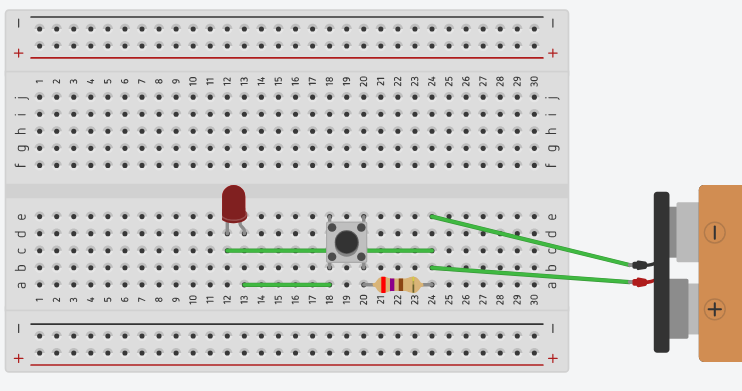
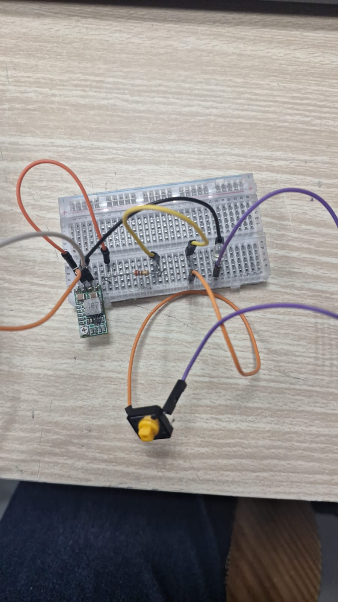

**Objetivo:**  
Aprender a realizar solda de componentes e manipulação de circuitos.

### Cronograma

**1º Estágio**

- Explicar como funciona o ferro de solda
- Fazer **2 trilhas** em uma placa ilhada de fenolite
    - A ideia seria fazer duas trilhas de 4x1 com 2 furos de distância
- Retirar parte da trilha com um **sugador de solda**
- Retirar parte da trilha com uma **malha de dessolda**
- Soldar 2 fios juntos
- Soldar um fio em uma trilha
- Verificar continuidade entre duas trilhas
- Soldar a outra ponta do fio na outra trilha e ver a continuidade agora

**2º Estágio**
> OBS: Coloque o conector jst em um canto, de dois furos de distância entre ele e o switch. Para o switch com o conector preto tem que dar 3 furos
- Soldar um **conector de jumper de 4 pinos na placa**
- Soldar um **conector branco de 3 pinos na placa**
- Soldar um **switch** no meio do circuito

**3º Estágio**

- Para entender como o buck funciona, recomenda-se a leitura de: https://www.otronic.nl/en/step-down-buck-converter-from-45v-24v-to-5v-3a-4r.html
- Conectar o buck
- Planejar como conectar uma **bateria no buck** para obter **5V de saída**
- Realizar a solda completa do circuito
- Verificar continuidade
- Conectar a bateria **caso tudo esteja nos conformes**
- Testar se a saída está em **5V** e não na tensão da bateria

**4º Estágio**

> +5 V → 270 Ω → ânodo do LED → cátodo → GND
> O lado longo do LED é o ânodo (+) e o lado chato/curto é o cátodo (–).

- Na saida de 5V conectar um resistor (Vermelho, Roxo, Marrom, Dourado 270) 
- Em série com o resistor coloque um botão
- Conecte no outro pino do botão um LED
- No outro pino do LED conecte ao GND do sistema.

## Solda

- Fios
- Placa de fenolite
- Estanho
- Fluxo
- Estação de solda
- Sugador de solda
- Malha de dessolda
- Escova
- Álcool
- Conectores fêmea (branco e preto)
- Buck converter
- Bateria
- Switch
- Multímetro
- Botão
- Resistor
- Led vermelho
